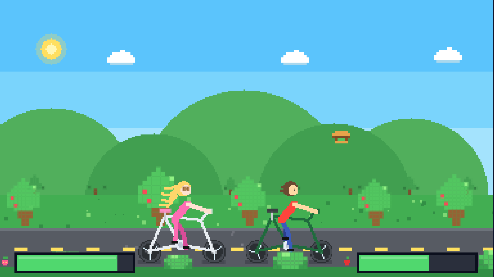
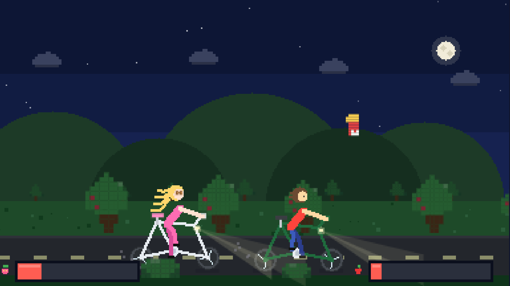

# DontCryCycle

Пиксель-арт игра про двух велосипедистов, преодолевающих трудности в дороге.

## Скриншоты

| День | Ночь | Голод |
| --- | --- | --- |
|  |  |  |

## Геймплей

- **Space** — прыжок (мальчик и девочка прыгают по очереди).
- Ловите летящую еду, чтобы накормить велосипедистов.
- **Две шкалы сытости**: мальчик справа, девочка слева.
- **Осторожно**: девочка не ест мясо!

## День и ночь

- Цикл дня и ночи меняется автоматически каждые 30 секунд (плавный переход).
- Ночью велосипедисты автоматически включают фонарики.
- **N** — переключить день/ночь вручную.
- **L** — включить/выключить фонарики вручную.

## Как запустить

Откройте `index.html` в любом браузере.

## Структура

- `index.html` — разметка
- `style.css` — стили
- `script.js` — вся игровая логика и отрисовка
