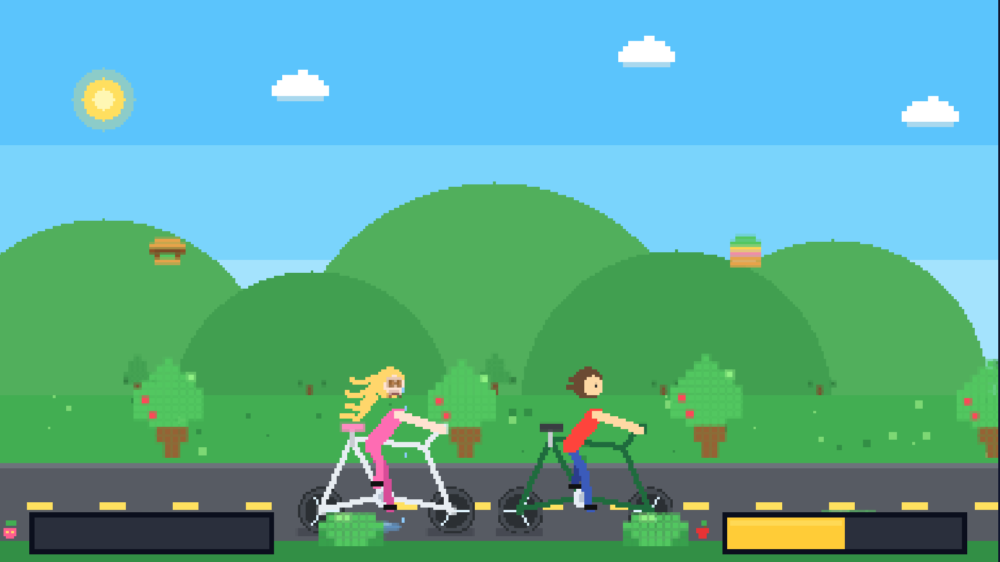

# DontCryCycle

A pixel-art game about two cyclists overcoming the hardships of the road.

## Screenshots

| Day | Night | Hungry |
| --- | --- | --- |
|  |  |  |

## Gameplay

- **Space** — jump (the boy and the girl take turns jumping).
- Catch the flying food to feed the cyclists.
- **Two hunger bars**: the boy's on the right, the girl's on the left.
- **Careful**: the girl doesn't eat meat! If she catches a burger — her hunger bar drops to zero, and she gets offended.

## Day and night

- The day/night cycle changes automatically every 30 seconds (with a smooth transition).
- At night the cyclists automatically turn on their lights.
- **N** — toggle day/night manually.
- **L** — toggle the lights manually.

## How to run

Open `index.html` in any browser.

## Structure

- `index.html` — markup
- `style.css` — styles
- `script.js` — all the game logic and rendering

---

# DontCryCycle

Пиксель-арт игра про двух велосипедистов, преодолевающих трудности в дороге.

## Скриншоты

| День | Ночь | Голод |
| --- | --- | --- |
|  |  |  |

## Геймплей

- **Space** — прыжок (мальчик и девочка прыгают по очереди).
- Ловите летящую еду, чтобы накормить велосипедистов.
- **Две шкалы сытости**: мальчик справа, девочка слева.
- **Осторожно**: девочка не ест мясо! Если она поймает бургер — сытость обнулится, и она обидится.

## День и ночь

- Цикл дня и ночи меняется автоматически каждые 30 секунд (плавный переход).
- Ночью велосипедисты автоматически включают фонарики.
- **N** — переключить день/ночь вручную.
- **L** — включить/выключить фонарики вручную.

## Как запустить

Откройте `index.html` в любом браузере.

## Структура

- `index.html` — разметка
- `style.css` — стили
- `script.js` — вся игровая логика и отрисовка
